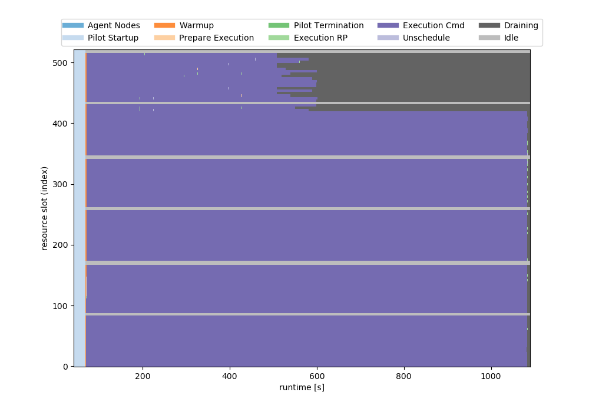
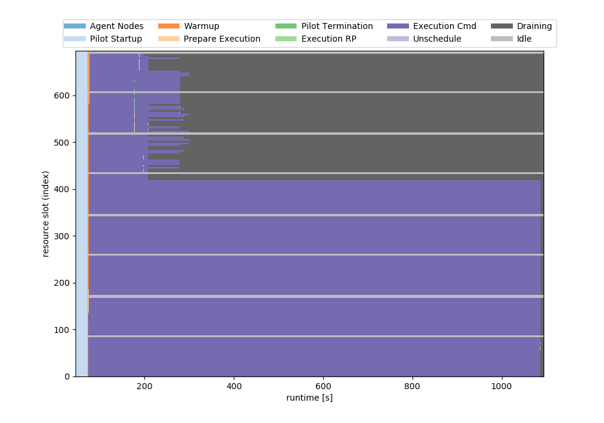
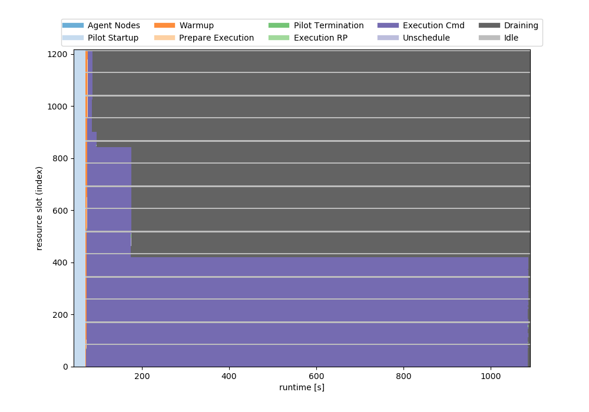

## 126CPUs for 100 Tasks * 1000/100/10secs

- 1000/100/10second tasks have 1/3/100 generations

## 168CPUs for 100 Tasks * 1000/100/10secs

- 1000/100/10second tasks have 1/2/50 generations

## 210CPUs for 100 Tasks * 1000/100/10secs

- 1000/100/10second tasks have 1/1/10 generations

## 252CPUs for 100 Tasks * 1000/100/10secs

- 1000/100/10second tasks have 1/1/2 generations
