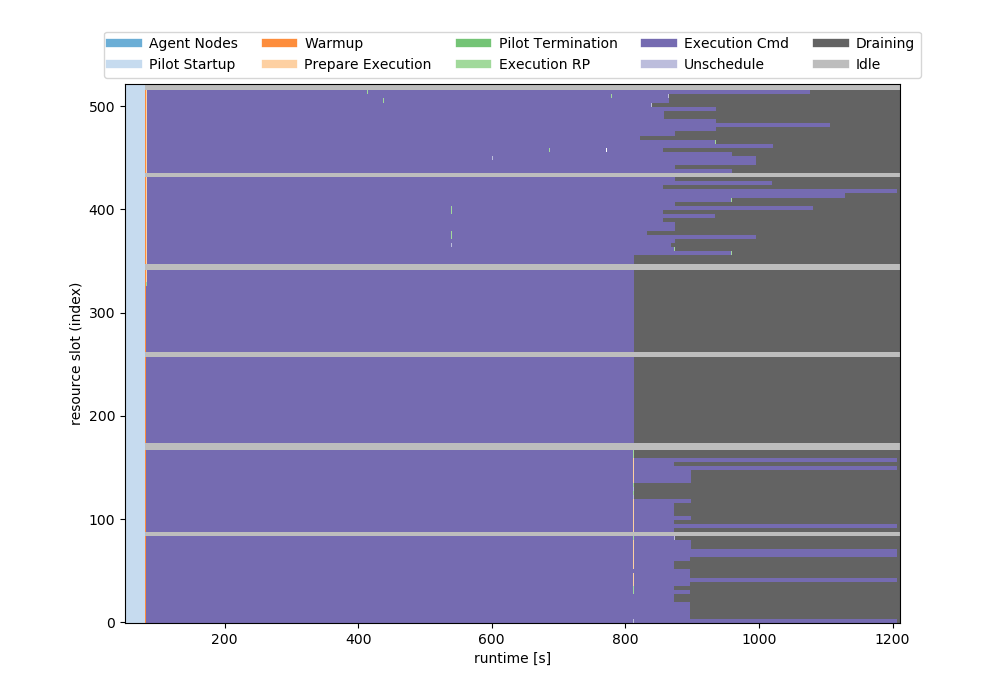
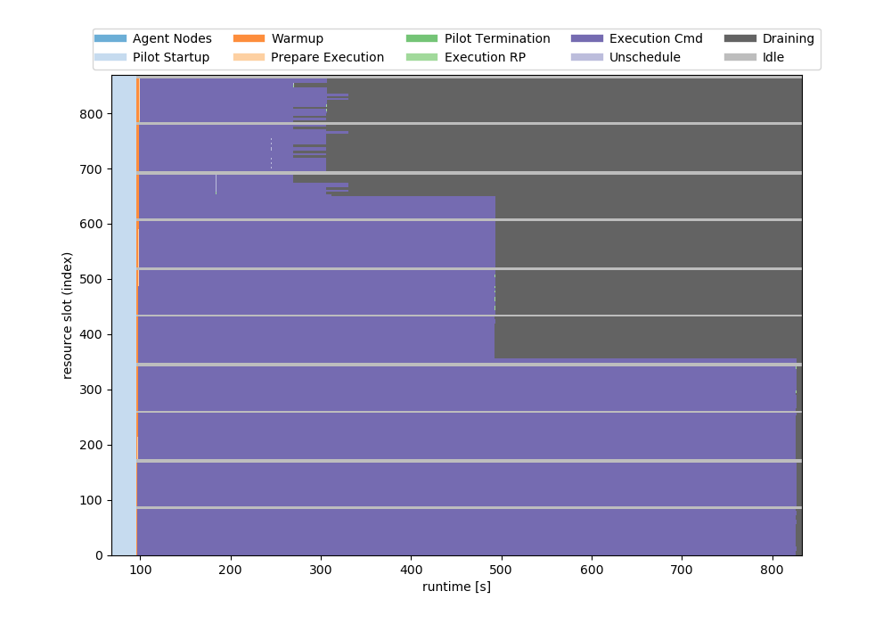
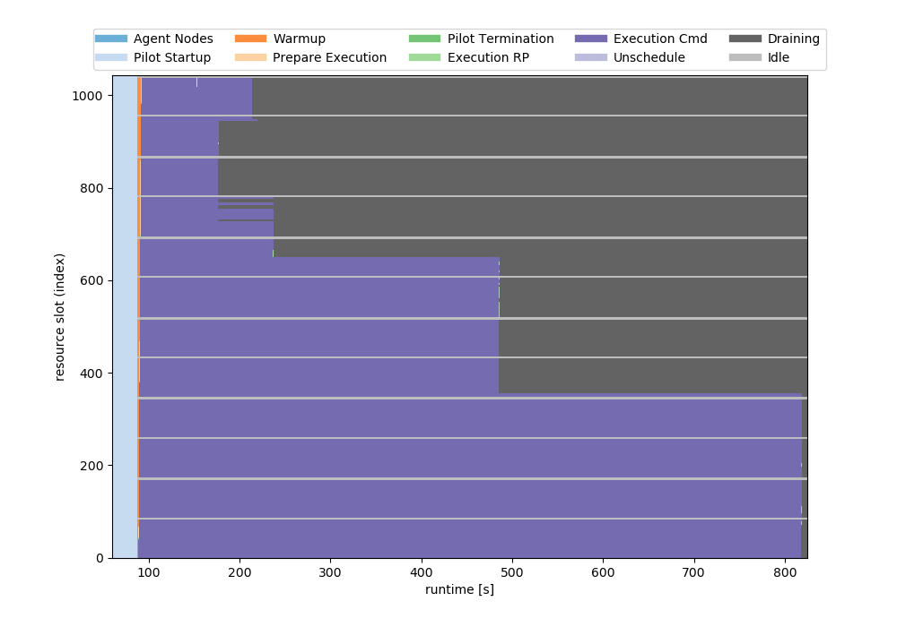

## 126CPUs for 295 Tasks (12 MD runs/10 CVAE/10 TICA/10 Inference/1 RLDock) * 7 times increased

- 7200/3900/840/600/6second tasks have 1/2/10/10/1 generations

## 168CPUs for 295 Tasks (12 MD runs/10 CVAE/10 TICA/10 Inference/1 RLDock) * 7 times increased

- 7200/3900/840/600/6second tasks have 1/1/10/10/1 generations

## 210CPUs for 295 Tasks (12 MD runs/10 CVAE/10 TICA/10 Inference/1 RLDock) * 7 times increased

- 7200/3900/840/600/6second tasks have 1/1/10/10/1 generations

## 252CPUs for 295 Tasks (12 MD runs/10 CVAE/10 TICA/10 Inference/1 RLDock) * 7 times increased

- 7200/3900/840/600/6second tasks have 1/1/10/10/1 generations
